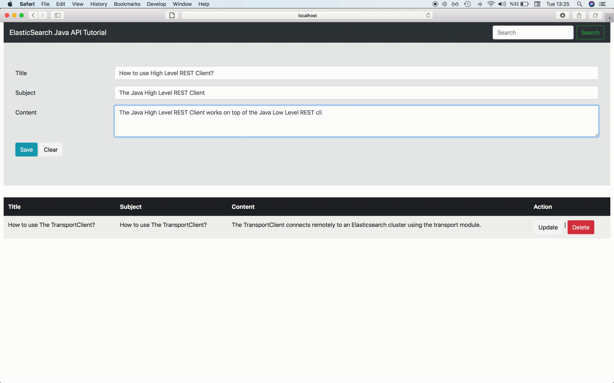

A demonstration of how to use Elasticsearch Java API
===================================================

This repository demonstrates the use of Elasticsearch Java API via `Java High Level REST Client`. If you want to see the sample of the old version, please visit the [oldVersion](https://github.com/hakdogan/ElasticSearch/tree/oldVersion) branch.

## What you will learn in this repository?

* How to use Java High Level REST Client
  * How to perform Administration operations
  * Index creation
  * Mapping settings
  * How to perform CRUD operations


### Initialization Java High Level REST Client
```java
    @Bean(destroyMethod = "close")
    public RestHighLevelClient getRestClient() {
        return new RestHighLevelClient(RestClient.builder(new HttpHost(props.getClients().getHostname(),
                props.getClients().getHttpPort(), props.getClients().getScheme())));
    }
```

### Index creation and Shard, Replica settings with Java High Level REST Client
```java
final GetIndexRequest request = new GetIndexRequest(props.getIndex().getName());
final boolean exists = client.indices().exists(request, RequestOptions.DEFAULT);

if (!exists) {
    
  final CreateIndexRequest indexRequest = new CreateIndexRequest(props.getIndex().getName());
  indexRequest.settings(Settings.builder()
       .put("index.number_of_shards", props.getIndex().getShard())
       .put("index.number_of_replicas", props.getIndex().getReplica())
  );

  final CreateIndexResponse createIndexResponse = client.indices().create(indexRequest, RequestOptions.DEFAULT);
  if (createIndexResponse.isAcknowledged() && createIndexResponse.isShardsAcknowledged()) {
      log.info("{} index created successfully", props.getIndex().getName());
  } else {
      log.debug("Failed to create {} index", props.getIndex().getName());
  }

}
```

### Mapping Settings
```java
    
final PutMappingRequest mappingRequest = new PutMappingRequest(props.getIndex().getName());
final XContentBuilder builder = XContentFactory.jsonBuilder();
    
builder.startObject();
...
builder.endObject();        

mappingRequest.source(builder);
final AcknowledgedResponse putMappingResponse = client.indices().putMapping(mappingRequest, RequestOptions.DEFAULT);

if (putMappingResponse.isAcknowledged()) {
    log.info("Mapping of {} was successfully created", props.getIndex().getName());
} else {
    log.debug("Creating mapping of {} failed", props.getIndex().getName());
}
```

### Using SearchSourceBuilder and showing search results
```java
sourceBuilder.query(builder);
SearchRequest searchRequest = getSearchRequest();

SearchResponse searchResponse = client.search(searchRequest, RequestOptions.DEFAULT);
SearchHits hits = searchResponse.getHits();
SearchHit[] searchHits = hits.getHits();
for (SearchHit hit : searchHits) {
    Document doc = gson.fromJson(hit.getSourceAsString(), Document.class);
    doc.setId(hit.getId());
    result.add(doc);
}
```

### Using Query String with Wildcard
```java
result = getDocuments(QueryBuilders.queryStringQuery("*" + query.toLowerCase() + "*"));
```

### Document deletion
```
final DeleteRequest deleteRequest = new DeleteRequest(props.getIndex().getName(), id);
client.delete(deleteRequest, RequestOptions.DEFAULT);
```

## How to compile?
```
mvn clean install
```
The docker-maven-plugin needs Docker daemon, if you don't have it you should use `-Dmaven.test.skip=true -Ddocker.skip` parameters.

## How to run?
```
mvn spring-boot:run
```

With this option, you should provide an `elasticsearch server`.

## How to run with Docker?
```
sh run.sh
```

With this option, this application and an `elasticsearch server` run together.


